# AI棒 システム設計書（改訂版）

## 1. システム概要

### 1.1 設計目的
本書は、AI棒システムの詳細設計を定義する。要件定義書で示された機能要件と非機能要件を満たすシステム構造を設計し、実装の基盤となる技術仕様を明確化する。

### 1.2 システムコンセプト
AI棒は、ユーザーの要求仕様からシステム構築までの全工程をAIが支援するジェネレーターである。複数のAI（専門家AI、まとめAI）による並列処理と統合アプローチにより、高品質なシステム開発を実現する。ユーザーは各フェーズで専門家AIの構成やAIプロバイダーを自由にカスタマイズできる。

### 1.3 スコープ
- 要件定義フェーズ（繰り返し処理対応、拡張入力機能付き）
- 設計フェーズ（繰り返し処理対応、拡張入力機能付き）
- 実装・環境構築フェーズ
- テストフェーズ
- ビルド・デプロイフェーズ
- メンテナンスモード
- 各種設定機能（AIプロバイダー設定、専門家AI設定）

## 2. システムアーキテクチャ

### 2.1 全体アーキテクチャ


### 2.2 システムレイヤー


### 2.3 データフロー


## 3. コンポーネント設計

### 3.1 フロントエンドUI

#### 3.1.1 画面構成

```
+-----------------------------------------------------------+
|                       ヘッダー                             |
+-----------------------------------------------------------+
|                                                           |
|  +-------------+                +---------------------+   |
|  | ナビゲーション |                |   メインコンテンツ     |   |
|  |             |                |                     |   |
|  | - プロジェクト  |                | [現在のフェーズ内容]   |   |
|  | - フェーズ    |                |                     |   |
|  | - 設定       |                |                     |   |
|  |             |                |                     |   |
|  |             |                |                     |   |
|  +-------------+                +---------------------+   |
|                                                           |
|                       フッター                             |
+-----------------------------------------------------------+
```

#### 3.1.2 主要画面

1. **プロジェクト作成画面**
   - プロジェクト名入力
   - 要求仕様入力（シンプルな単一入力フィールド）
   - 詳細設定オプション（折りたたみ式）

2. **要件定義フェーズ画面**
   - イテレーション情報表示（回数、一致度）
   - 専門家AI分析状況表示
   - まとめAI結果表示
   - 質問・回答インターフェース（自動回答表示機能付き）
   - 要件定義ドキュメント表示
   - 要件追加モーダル

3. **設計フェーズ画面**
   - イテレーション情報表示
   - 設計ドキュメント表示
   - 図表表示（Mermaid描画）
   - レビュー・コメント機能
   - 設計追加モーダル

4. **実装フェーズ画面**
   - タスク一覧と進捗状況
   - コード生成状況表示
   - ファイルツリー表示
   - コードプレビュー

5. **設定画面**
   - AIプロバイダー設定
     - 複数プロバイダー対応（OpenAI, Anthropic, Azure, Google, OpenRouter）
     - APIキー・エンドポイント設定
     - モデル選択
   - 専門家AI設定
     - 要件定義/設計フェーズごとの専門家AI構成
     - ペルソナカスタマイズ
     - モデル割り当て
     - 優先度設定

#### 3.1.3 状態管理


### 3.2 AI処理エンジン

#### 3.2.1 専門家AIマネージャー

**コンポーネント構造**


#### 3.2.2 まとめAI

**コンポーネント構造**


#### 3.2.3 AIプロバイダーサービス

**コンポーネント構造**


### 3.3 イテレーション管理


### 3.4 設定マネージャー


## 4. データモデル設計

### 4.1 プロジェクトデータモデル


### 4.2 主要クラス構造

```mermaid
classDiagram
    class AIBoCore {
        -projectManager: ProjectManager
        -phaseController: PhaseController
        -aiCoordinator: AICoordinator
        -settingsManager: SettingsManager
        -uiController: UIController
        +initialize()
        +startProject(spec)
        +processUserInput(input)
        +generateOutput()
        +updateSettings(settings)
    }
    
    AIBoCore "1" *-- "1" ProjectManager
    AIBoCore "1" *-- "1" PhaseController
    AIBoCore "1" *-- "1" AICoordinator
    AIBoCore "1" *-- "1" SettingsManager
    AIBoCore "1" *-- "1" UIController
    
    class AICoordinator {
        -expertAIManager: ExpertAIManager
        -summarizationAI: SummarizationAI
        -codeGenerationManager: CodeGenerationManager
        -testManager: TestManager
        -deployManager: DeployManager
        -aiProviderService: AIProviderService
        +coordinateRequirementsAnalysis()
        +coordinateDesign()
        +coordinateImplementation()
        +coordinateTest()
        +coordinateDeploy()
    }
    
    AICoordinator "1" *-- "1" ExpertAIManager
    AICoordinator "1" *-- "1" SummarizationAI
    AICoordinator "1" *-- "1" CodeGenerationManager
    AICoordinator "1" *-- "1" TestManager
    AICoordinator "1" *-- "1" DeployManager
    AICoordinator "1" *-- "1" AIProviderService
```



## 5. インターフェース設計

### 5.1 ユーザーインターフェース

#### 5.1.1 プロジェクト作成画面

```
+--------------------------------------------------------------+
|                       AI棒                                    |
+--------------------------------------------------------------+
|                                                              |
|  新規プロジェクト作成                                         |
|                                                              |
|  プロジェクト名: [                                    ]       |
|                                                              |
|  プロジェクト概要（どんなシステムを作りたいか）:              |
|  +----------------------------------------------------------+|
|  |                                                          ||
|  |                                                          ||
|  |                                                          ||
|  +----------------------------------------------------------+|
|                                                              |
|  [詳細設定を表示 ▼]                                          |
|                                                              |
|  +----------------------------------------------------------+|
|  | □ 技術スタック指定                                       ||
|  | □ アーキテクチャ指定                                     ||
|  | □ データベース要件                                       ||
|  | □ セキュリティ要件                                       ||
|  | □ パフォーマンス要件                                     ||
|  +----------------------------------------------------------+|
|                                                              |
|                         [キャンセル]  [作成する]             |
+--------------------------------------------------------------+
```

#### 5.1.2 要件定義フェーズ画面

```
+--------------------------------------------------------------+
|                       AI棒                                    |
+--------------------------------------------------------------+
| [プロジェクト] > [要件定義フェーズ]                          |
+--------------------------------------------------------------+
|                                                              |
| イテレーション: 1/3  意見一致度: [====------] 42%            |
|                                                              |
|  +---------------------+  +--------------------------------+ |
|  | 専門家AI分析        |  | 要件定義ドキュメント           | |
|  |                     |  |                                | |
|  | ○ 技術専門家       |  | # プロジェクト要件             | |
|  | ○ セキュリティ専門家|  |                                | |
|  | ○ ビジネスアナリスト|  | ## 1. 機能要件                 | |
|  | ○ エンドユーザー   |  | - 機能1: ...                   | |
|  | ○ 保守担当者       |  | - 機能2: ...                   | |
|  |                     |  |                                | |
|  +---------------------+  | ## 2. 非機能要件               | |
|                           | ...                            | |
|  +----------------------+ |                                | |
|  | 質問と回答           | +--------------------------------+ |
|  |                      | |                                  |
|  | ユーザー回答が必要:  | |                                  |
|  | 質問1: 対象ユーザーは| |                                  |
|  | 企業内ユーザーですか?| |                                  |
|  |                      | |                                  |
|  | [回答を入力]         | |                                  |
|  |                      | |                                  |
|  | 自動回答済み:        | |                                  |
|  | 質問2: スマホ対応は? | |                                  |
|  | 回答: 必要 (信頼度:高)| |                                 |
|  |                      | |                                  |
|  | 質問3: バックアップは| |                                  |
|  | 回答: 日次 (信頼度:中)| |                                 |
|  |                      | |                                  |
|  | [自動回答を編集]     | |                                  |
|  +----------------------+ |                                  |
|                           |                                  |
|  [やり直す]  [質問に回答]  [要件を追加]  [次へ進む]          |
+--------------------------------------------------------------+

// 要件追加モーダル
+--------------------------------------------------------------+
|  追加要件の入力                                    [×]       |
+--------------------------------------------------------------+
|                                                              |
|  現在の要件に追加したい要求仕様を入力してください:           |
|  +----------------------------------------------------------+|
|  |                                                          ||
|  |                                                          ||
|  |                                                          ||
|  +----------------------------------------------------------+|
|                                                              |
|  注意: この入力内容をもとに、AIが再度要件分析を行い、        |
|  既存の要件に新たな要件を追加します。イテレーションカウンター|
|  はリセットされ、意見が一致するか最大回数に達するまで       |
|  繰り返します。                                              |
|                                                              |
|            [キャンセル]    [追加して再開]                    |
+--------------------------------------------------------------+
```

#### 5.1.3 設定画面 - AIプロバイダー

```
+--------------------------------------------------------------+
|                       AI棒 設定                              |
+--------------------------------------------------------------+
|                                                              |
|  +----------------------------------------------------------+|
|  | AI API設定                        [接続テスト] [専門家AI] ||
|  |                                                          ||
|  | AI プロバイダー: [OpenAI (GPT-4/3.5)    ▼]              ||
|  |                                                          ||
|  | API キー: [********************************]              ||
|  | OpenAIのAPIキーは"sk-"で始まります                       ||
|  |                                                          ||
|  | API エンドポイント（オプション）: [                    ] ||
|  |                                                          ||
|  +----------------------------------------------------------+|
|                                                              |
|  +----------------------------------------------------------+|
|  | モデル設定                                               ||
|  |                                                          ||
|  | デフォルトモデル: [GPT-4                   ▼]           ||
|  |                                                          ||
|  | Temperature: [================|=====] 0.7               ||
|  | 精確 (0)          標準 (1)          創造的 (2)          ||
|  |                                                          ||
|  | 最大トークン数: [======|===============] 4000            ||
|  |                                                          ||
|  | カスタムモデル                             [+ 追加]      ||
|  |                                                          ||
|  | カスタムモデルはまだ追加されていません                   ||
|  |                                                          ||
|  +----------------------------------------------------------+|
|                                                              |
|                      [キャンセル]  [設定を保存]              |
+--------------------------------------------------------------+
```

#### 5.1.4 設定画面 - 専門家AI設定

```
+--------------------------------------------------------------+
|                    専門家AI設定                              |
+--------------------------------------------------------------+
|                                                              |
|  +----------------------------------------------------------+|
|  | 要件定義フェーズの専門家AI                               ||
|  |                                                          ||
|  | 専門家の数: [3 ▼]                                        ||
|  |                                                          ||
|  | [技術専門家]                                     [編集]  ||
|  | モデル: GPT-4   専門: アーキテクチャ, パフォーマンス... ||
|  |                                                       ↑↓ ||
|  |                                                          ||
|  | [セキュリティ専門家]                            [編集]  ||
|  | モデル: GPT-4   専門: セキュリティ, コンプライアンス    ||
|  |                                                       ↑↓ ||
|  |                                                          ||
|  | [ビジネスアナリスト]                            [編集]  ||
|  | モデル: Claude-3 Opus   専門: ビジネス要件              ||
|  |                                                       ↑↓ ||
|  |                                                          ||
|  +----------------------------------------------------------+|
|                                                              |
|  +----------------------------------------------------------+|
|  | 設計フェーズの専門家AI                                   ||
|  |                                                          ||
|  | 専門家の数: [3 ▼]                                        ||
|  |                                                          ||
|  | [システムアーキテクト]                          [編集]  ||
|  | モデル: GPT-4   専門: アーキテクチャ, API設計...        ||
|  |                                                       ↑↓ ||
|  |                                                          ||
|  | ...                                                      ||
|  |                                                          ||
|  +----------------------------------------------------------+|
|                                                              |
|                      [キャンセル]  [設定を保存]              |
+--------------------------------------------------------------+

// 専門家AI編集モーダル
+--------------------------------------------------------------+
|  専門家AI設定                                     [×]       |
+--------------------------------------------------------------+
|                                                              |
|  プリセット: [選択してください...               ▼]           |
|                                                              |
|  名前: [技術専門家]                                          |
|                                                              |
|  説明: [技術的な実現可能性、スケーラビリティ、パフォーマンス |
|        に重点を置く                                        ] |
|                                                              |
|  アイコンタイプ: [tech ▼]                                   |
|                                                              |
|  AIモデル: [GPT-4 (OpenAI) ▼]                               |
|                                                              |
|  専門分野:                                                   |
|  [✓] アーキテクチャ  [✓] パフォーマンス  [ ] ユーザビリティ |
|  [✓] バックエンド    [✓] スケーラビリティ [ ] フロントエンド |
|  [ ] セキュリティ    [ ] データベース     [ ] モバイル      |
|  ...                                                         |
|                                                              |
|  優先度:                                                     |
|  パフォーマンス:  [=========|=] 9                           |
|  セキュリティ:    [=======|===] 7                           |
|  ユーザビリティ:  [=====|=====] 5                           |
|  保守性:          [========|==] 8                           |
|  革新性:          [=======|===] 7                           |
|                                                              |
|               [キャンセル]    [保存]                         |
+--------------------------------------------------------------+
```

### 5.2 AI間インターフェース

#### 5.2.1 専門家AI - まとめAIインターフェース

```json
{
  "expert_analysis": {
    "persona_id": "tech_expert_1",
    "persona_name": "技術専門家",
    "model_id": "gpt-4",
    "analysis": {
      "requirements": [
        {
          "id": "FR-001",
          "description": "ユーザー認証システムの実装",
          "priority": "MUST",
          "rationale": "セキュリティとユーザー識別のため必須",
          "details": "..."
        }
      ],
      "concerns": [
        {
          "id": "CON-001",
          "topic": "スケーラビリティ",
          "description": "想定ユーザー数が明確でない"
        }
      ],
      "questions": [
        {
          "id": "Q-001",
          "question": "同時接続ユーザー数はどの程度を想定していますか？",
          "context": "性能要件の定義に必要",
          "priority": "HIGH",
          "requires_user_input": true,
          "reason_for_user_input": "ビジネス要件に関する意思決定が必要"
        },
        {
          "id": "Q-002",
          "question": "モバイル対応は必要ですか？",
          "context": "UIの設計とレスポンシブ対応の判断に必要",
          "priority": "MEDIUM",
          "requires_user_input": false,
          "auto_answerable_context": "現代のWebアプリケーションでは標準的に必要な機能"
        }
      ]
    }
  }
}
```

#### 5.2.2 まとめAI - フロントエンドインターフェース

```json
{
  "summarized_requirements": {
    "requirements": [
      // 統合された要件リスト
    ],
    "conflicts": [
      {
        "id": "CONF-001",
        "requirements": ["FR-003", "FR-007"],
        "description": "パフォーマンスとセキュリティのトレードオフが存在",
        "resolution_options": [
          {
            "id": "RES-001",
            "description": "セキュリティ優先アプローチ",
            "impact": "パフォーマンスがやや低下"
          },
          {
            "id": "RES-002",
            "description": "パフォーマンス優先アプローチ",
            "impact": "セキュリティ層の簡素化"
          }
        ]
      }
    ],
    "questions": {
      "user_required_questions": [
        {
          "id": "Q-001",
          "question": "同時接続ユーザー数はどの程度を想定していますか？",
          "context": "性能要件の定義に必要",
          "priority": "HIGH",
          "reason_for_user_input": "ビジネス要件に関する意思決定が必要"
        }
      ],
      "auto_answered_questions": [
        {
          "id": "Q-002",
          "question": "モバイル対応は必要ですか？",
          "answer": "はい、モバイル対応が必要です。",
          "confidence": "HIGH",
          "rationale": "現代のWebアプリケーションでは標準的に必要な機能であり、要求仕様からユーザーの利便性重視の姿勢が読み取れるため。",
          "impact_on_requirements": ["FR-012", "NFR-005"]
        }
      ]
    },
    "consensus_evaluation": {
      "score": 0.72,
      "disagreement_areas": [
        {
          "topic": "データストレージ方式",
          "experts": ["tech_expert_1", "security_expert_1"]
        }
      ],
      "iteration_recommendation": "CONTINUE"
    }
  }
}
```

## 6. 技術仕様

### 6.1 実行環境仕様

#### 6.1.1 ライトモード

- **対象ハードウェア**:
  - CPU: 4コア以上
  - RAM: 8GB以上
  - ストレージ: 20GB空き容量
  - GPU: 任意（統合グラフィックス可）

- **AI処理制限**:
  - フェーズごとに最大2つの専門家AIペルソナ
  - 簡略化されたまとめAI処理
  - 小〜中規模プロジェクト対応

- **機能制限**:
  - 生成コードの複雑性制限
  - 基本的なテストケースのみ
  - シンプルなデプロイオプション

#### 6.1.2 スタンダードモード

- **対象ハードウェア**:
  - CPU: 8コア以上
  - RAM: 16GB以上
  - ストレージ: 50GB SSD
  - GPU: CUDA対応（4GB VRAM以上）推奨

- **AI処理能力**:
  - フェーズごとに最大3つの専門家AIペルソナ
  - 完全なまとめAI処理
  - 中〜大規模プロジェクト対応

- **機能セット**:
  - 全機能利用可能
  - 包括的なテスト生成
  - 多様なデプロイオプション

#### 6.1.3 プロフェッショナルモード

- **対象ハードウェア**:
  - CPU: 12コア以上
  - RAM: 32GB以上
  - ストレージ: 100GB NVMe SSD
  - GPU: CUDA対応（8GB VRAM以上）

- **AI処理能力**:
  - フェーズごとに最大5つの専門家AIペルソナ
  - 最適化されたAI処理パイプライン
  - 大規模・複雑プロジェクト対応

- **拡張機能**:
  - 高度な最適化オプション
  - 詳細なパフォーマンス分析
  - エンタープライズ級の統合・デプロイ

### 6.2 対応AIプロバイダー

#### 6.2.1 OpenAI

- **エンドポイント**: https://api.openai.com
- **認証方式**: APIキー認証
- **対応モデル**:
  - GPT-4
  - GPT-4 Turbo
  - GPT-4 32k
  - GPT-3.5 Turbo
  - GPT-3.5 Turbo 16k

#### 6.2.2 Anthropic

- **エンドポイント**: https://api.anthropic.com
- **認証方式**: APIキー認証
- **対応モデル**:
  - Claude 3 Opus
  - Claude 3 Sonnet
  - Claude 3 Haiku
  - Claude 2

#### 6.2.3 Azure OpenAI

- **エンドポイント**: カスタム（ユーザー指定）
- **認証方式**: APIキー認証
- **対応モデル**:
  - デプロイメント名による（ユーザー指定）

#### 6.2.4 Google Vertex AI

- **エンドポイント**: リージョンによる
- **認証方式**: サービスアカウントキー（JSON）
- **対応モデル**:
  - Gemini Pro
  - Gemini Ultra

#### 6.2.5 OpenRouter

- **エンドポイント**: https://openrouter.ai/api
- **認証方式**: APIキー認証
- **対応モデル**:
  - OpenAI (GPT-4/3.5)
  - Anthropic (Claude)
  - Google (Gemini)
  - Mistral (Medium/Large)
  - Meta (Llama)
  - その他多数

#### 6.2.6 ローカルモデル

- **エンドポイント**: localhost
- **認証方式**: なし
- **対応モデル**:
  - ローカルにダウンロードした任意のモデル

### 6.3 コード生成仕様

#### 6.3.1 コード生成エンジン

- **生成モデル**:
  - 階層的コード生成（構造→詳細）
  - コンテキスト認識生成
  - プログレッシブリファインメント

- **最適化レベル**:
  - レベル1: 機能優先（単純で読みやすいコード）
  - レベル2: バランス（適度な最適化と読みやすさ）
  - レベル3: パフォーマンス優先（高度な最適化）

- **生成フロー**:
  1. 設計仕様の分解
  2. コンポーネント構造生成
  3. インターフェース定義
  4. 実装詳細化
  5. ドキュメント・コメント生成
  6. テストコード生成

#### 6.3.2 言語別最適化

- **JavaScript/TypeScript**:
  - モジュールパターン
  - 非同期処理の最適化
  - TypeScript型定義の厳密化

- **Python**:
  - PEP 8準拠
  - 型ヒント活用
  - パフォーマンス最適化パターン

- **Java**:
  - オブジェクト指向設計パターン
  - スレッド安全設計
  - メモリ効率の最適化

- **C#**:
  - .NET固有パターン
  - LINQ最適化
  - 非同期処理のベストプラクティス

## 7. 実装計画

### 7.1 開発フェーズ

1. **フェーズ1: コアエンジン開発**
   - 基本AI処理エンジン
   - 専門家AI・まとめAIの基盤実装
   - プロジェクト管理基盤
   - 設定システム（AIプロバイダー、専門家AI）

2. **フェーズ2: 要件・設計処理**
   - 要件定義フェーズの完全実装
   - 設計フェーズの完全実装
   - イテレーション管理システム
   - 追加入力モーダル機能

3. **フェーズ3: コード生成エンジン**
   - タスク分割機能
   - Tier 1言語向けコード生成
   - 統合・検証機能

4. **フェーズ4: テスト・デプロイ**
   - テスト生成・実行
   - 環境構築自動化
   - デプロイ機能

5. **フェーズ5: UI完成とシステム統合**
   - ユーザーインターフェース完成
   - 全フェーズ統合
   - エンドツーエンドテスト

### 7.2 マイルストーン

1. **M1: PoC (Proof of Concept)**
   - 単一言語での要件→コード生成
   - 基本UI
   - 動作検証

2. **M2: アルファ版**
   - OpenAIプロバイダー対応
   - 要件→設計→実装フロー
   - 基本的な専門家AI設定

3. **M3: ベータ版**
   - 全フェーズ実装
   - 複数AIプロバイダー対応
   - イテレーション機能

4. **M4: RC (Release Candidate)**
   - 全機能実装
   - 専門家AI設定の完全化
   - パフォーマンス最適化

5. **M5: 製品版**
   - 完全品質保証
   - ドキュメント完成
   - ユーザーサポート体制

## 8. テスト戦略

### 8.1 テストレベル

1. **単体テスト**
   - 各AIコンポーネントの機能検証
   - 生成コードの検証
   - 境界条件テスト

2. **統合テスト**
   - AIコンポーネント間の連携
   - フェーズ間の遷移
   - データの受け渡し

3. **システムテスト**
   - エンドツーエンドプロセス検証
   - パフォーマンステスト
   - リソース使用率テスト

4. **受け入れテスト**
   - ユーザーシナリオテスト
   - 使用性テスト
   - クロスプラットフォームテスト

### 8.2 自動テスト戦略

1. **生成コードの検証**
   - コンパイル/構文チェック
   - 静的解析
   - 実行テスト

2. **環境構築検証**
   - クリーン環境での構築テスト
   - 依存関係解決テスト
   - クロスプラットフォームテスト

3. **デプロイ検証**
   - デプロイスクリプト検証
   - 環境互換性テスト
   - ロールバックテスト

## 9. メンテナンス計画

### 9.1 システム更新

1. **AI処理エンジン更新**
   - 最新AI技術の統合
   - 性能・精度向上
   - 新AIプロバイダー対応

2. **技術スタック拡張**
   - 新言語・フレームワークサポート
   - 既存サポートの深化

3. **セキュリティ更新**
   - 脆弱性対応
   - セキュリティベストプラクティス更新

### 9.2 既存プロジェクトサポート

1. **プロジェクト互換性**
   - 古いバージョンで作成されたプロジェクトのサポート
   - 移行ツール提供

2. **プロジェクト改善**
   - 既存コードの品質向上提案
   - 技術的負債検出・改善
